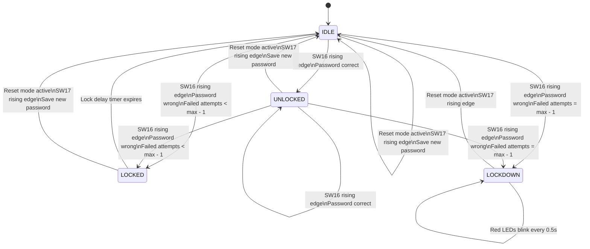

# FPGA Based Digital Smart Door Lock

## Project Overview

This project implements a digital smart door lock using Verilog HDL for an FPGA development board such as the DE2-115. The main focus of the design is the lockdown security layer mechanism, which demonstrates practical digital system logic concepts such as finite state machines, edge detection, counters, timers, password comparison, and output control.

The system uses FPGA switches as password and control inputs, green LEDs to indicate successful unlock, red LEDs to indicate lock or lockdown conditions, and seven-segment displays to show the current lock status.

## Key Features

- 10-bit password input using `SW[9:0]`
- Password verification using rising edge detection on `SW[16]`
- Password reset/set mode using `SW[11]` and `SW[12]`
- Password update using rising edge detection on `SW[17]`
- Failed attempt counter
- Temporary lock delay after a wrong password
- Permanent lockdown after maximum failed attempts
- Red LED flickering every 0.5 seconds during lockdown
- Seven-segment display status output

## Main Input Controls

| Signal | Function |
|---|---|
| `CLOCK_50` | 50 MHz FPGA clock |
| `SW[9:0]` | 10-bit password input |
| `SW[11]` | Reset mode control bit 1 |
| `SW[12]` | Reset mode control bit 2 |
| `SW[16]` | Verify password trigger |
| `SW[17]` | Set/reset password trigger |

`reset_mode = SW[11] & SW[12]`

## Finite State Machine Diagram



## Functional Behavior Table

| Case | Current Condition | Input Action | Password Match? | Internal Action | Expected LED Output | Expected HEX Output |
|---|---|---|---|---|---|---|
| 1 | Power-on / idle state | No verify trigger | Not checked | Wait for user input | `LEDG = 0`, `LEDR = 0` | Blank |
| 2 | Reset mode active | `SW[11]=1`, `SW[12]=1` | Not checked | Show reset mode; timers cleared | `LEDG = 0`, `LEDR = 0` | `RESET` |
| 3 | Reset mode active | `SW17` rising edge | Not checked | Save `SW[9:0]` as new password; clear failed attempts; return to `IDLE` | `LEDG = 0`, `LEDR = 0` | `RESET` while reset mode remains active |
| 4 | `IDLE` | `SW16` rising edge | Yes | Set state to `UNLOCKED`; clear failed attempts | `LEDG = all ON`, `LEDR = all OFF` | `UNLOCKED` |
| 5 | `IDLE` | `SW16` rising edge | No | Increase failed attempts; enter `LOCKED`; start lock delay timer | `LEDG = all OFF`, `LEDR = all ON` | `LOCKED` |
| 6 | `LOCKED` | During lock delay | Ignored | Countdown timer active | `LEDG = all OFF`, `LEDR = all ON` | `LOCKED` |
| 7 | `LOCKED` | Lock delay expires | Not checked | Return to `IDLE` if not in lockdown | `LEDG = all OFF`, `LEDR = all OFF` | Blank |
| 8 | Any non-lockdown state | Wrong password reaches maximum failed attempts | No | Enter `LOCKDOWN`; stop normal lock timer | `LEDG = all OFF`, `LEDR = blinking all ON/OFF every 0.5s` | `LOCKED` |
| 9 | `LOCKDOWN` | `SW16` rising edge | Ignored | Stay in lockdown | `LEDG = all OFF`, `LEDR = blinking all ON/OFF every 0.5s` | `LOCKED` |
| 10 | `LOCKDOWN` | Reset mode active only | Not checked | Show reset mode externally, but internal state remains unless `SW17` rises | `LEDG = 0`, `LEDR = 0` | `RESET` |
| 11 | `LOCKDOWN` + reset mode active | `SW17` rising edge | Not checked | Save new password; clear failed attempts; return to `IDLE` | `LEDG = 0`, `LEDR = 0` | `RESET` while reset mode remains active |
| 12 | `UNLOCKED` | `SW16` rising edge | Yes | Stay `UNLOCKED`; failed attempts remain cleared | `LEDG = all ON`, `LEDR = all OFF` | `UNLOCKED` |
| 13 | `UNLOCKED` | `SW16` rising edge | No | Increase failed attempts; enter `LOCKED` or `LOCKDOWN` depending on counter | `LEDG = all OFF`, `LEDR = all ON` or blinking | `LOCKED` |

## State Output Summary

| State | Meaning | Green LEDs | Red LEDs | Seven-Segment Display |
|---|---|---|---|---|
| `IDLE` | Waiting for password verification | OFF | OFF | Blank |
| `UNLOCKED` | Correct password entered | ON | OFF | `UNLOCKED` |
| `LOCKED` | Wrong password entered; temporary lock delay active | OFF | ON | `LOCKED` |
| `LOCKDOWN` | Maximum failed attempts reached | OFF | Flickers every 0.5 seconds | `LOCKED` |
| Reset mode | Password set/reset mode | OFF | OFF | `RESET` |

## Timing Parameters

| Parameter | Default Value | Purpose |
|---|---:|---|
| `CLK_FREQ_HZ` | `50000000` | FPGA clock frequency |
| `LOCK_DELAY_SEC` | `5` | Delay time after wrong password attempt |
| `MAX_FAILED_ATTEMPTS` | `5` | Number of failed attempts before lockdown |
| `BLINK_HALF_CYCLES` | `CLK_FREQ_HZ / 2` | Controls 0.5-second LED flicker interval |

## Suggested Repository Structure

```text
fpga-digital-smart-door-lock/
|-- README.md
|-- custom_FPGA_door_lock.v
|-- tb_custom_FPGA_door_lock.v
|-- docs/
|   `-- fsm_and_behavior.md
`-- constraints/
    `-- pin_assignment.tcl
```

## How to Upload This Project to GitHub

### Method 1: Upload Through GitHub Website

1. Sign in to GitHub.
2. Click the `+` button at the top right.
3. Select `New repository`.
4. Enter a repository name, for example:

```text
fpga-digital-smart-door-lock
```

5. Add a short description:

```text
FPGA based digital smart door lock using Verilog FSM, password verification, failed attempt counter, and lockdown LED flicker mechanism.
```

6. Choose `Public` if you want employers, lecturers, or recruiters to see it.
7. Create the repository.
8. Click `Add file` then `Upload files`.
9. Upload your Verilog source code, testbench, pin assignment file, and this README content.
10. Click `Commit changes`.

### Method 2: Upload Using Git Commands

Open a terminal in your project folder and run:

```bash
git init
git add .
git commit -m "Initial commit: FPGA digital smart door lock"
git branch -M main
git remote add origin https://github.com/YOUR_USERNAME/fpga-digital-smart-door-lock.git
git push -u origin main
```

Replace `YOUR_USERNAME` with your GitHub username.

## LinkedIn Caption

I recently developed an FPGA based Digital Smart Door Lock using Verilog HDL, focusing on the security logic behind the system rather than only the hardware output.

This project demonstrates key digital system design concepts including finite state machine design, password verification, edge detection, failed attempt counting, timer based lock delay, reset mode control, and a lockdown mechanism with red LED flickering every 0.5 seconds after the maximum failed attempts are exceeded.

Through this project, I strengthened my understanding of how FPGA logic can be used to build real-world security behavior at the hardware level.

Project highlights:
- Verilog HDL implementation
- FSM based lock control
- Password set and verify logic
- Failed attempt counter
- Lockdown security layer
- Seven-segment display status output
- LED based state indication

GitHub Repository:
`PASTE_YOUR_GITHUB_REPOSITORY_LINK_HERE`

#FPGA #Verilog #DigitalLogicDesign #HardwareDesign #EmbeddedSystems #EngineeringStudent #GitHubProjects
